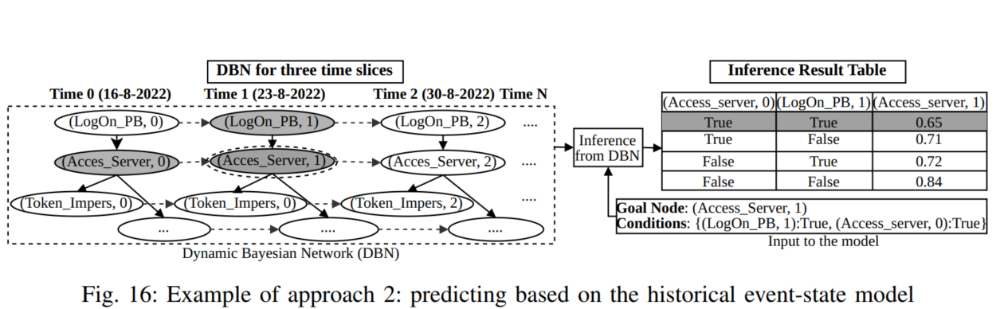

# Approach 2: Event-State Model-based DBN (Dynamic Bayesian Network)

## Overview

Approach 2 implements a sophisticated temporal reasoning framework using Dynamic Bayesian Networks to predict future security events in 5G networks. It leverages event-state models created from historical attack sequences to perform multi-step inference over time.

## Architecture

### Key Components

1. **Event-State Model Generator** (`generate_models.py`)
   - Creates diverse Bayesian Networks from event sequences
   - Generates 15+ models with different structures and characteristics
   - Supports random and attack-path-based generation

2. **Dynamic Bayesian Network** (`dbn_approach2.py`)
   - Implements temporal reasoning across multiple time slices
   - Performs Bayesian inference on event sequences
   - Enables multi-step future event prediction


The approach uses Dynamic Bayesian Networks with temporal connections:




## File Structure

```
Approach 2-ESMDBN/
├── generate_models.py           # Model generator
├── dbn_approach2.py            # DBN implementation
├── README.md                   # This file
├── requirements.txt            # Python dependencies
│
├── data/                       # Generated models directory
│   ├── models_index.json       # Index of all models
│   ├── attack_logon_1/
│   │   ├── model.pkl           # Pickled Bayesian Network
│   │   ├── metadata.json       # Model metadata
│   │   └── edges.json          # Model structure
│   └── ... 

```

## Usage

### 1. Generate Event-State Models

```bash
source /home/ubuntu/5GSPP/venv_5gspp/bin/activate
cd /home/ubuntu/5GSPP/2.\ Posture\ Prediction/Approach\ 2-ESMDBN

# Generate 20 diverse models
python generate_models.py
```


### 2. Build and Use DBN

```python
from dbn_approach2 import EventStateDBNModel

# Load a pre-trained model
model = EventStateDBNModel(model_path='data/attack_logon_1/model.pkl')

# Build DBN with 3 time slices
model.build_dbn()

# Perform inference
observations = {
    'Logon_PB': 1,
    'Access_Server': 1,
    'Token_Impersonation': 0
}

results = model.perform_inference(observations, ['goal_node'])
print(f"Goal node probability: {results['goal_node']:.4f}")

# Predict future events
initial_state = {e: 0 for e in model.events}
initial_state['Input_Credentials'] = 1

predictions = model.predict_sequence(initial_state, num_steps=3)
```


## Dependencies

```
pgmpy>=0.1.12
numpy>=1.21.0
pandas>=1.3.0
scikit-learn>=0.24.0
matplotlib>=3.5.0
```

Install with:
```bash
pip install -r requirements.txt
```

### Custom Model Integration

```python
from dbn_approach2 import EventStateDBNModel
from pgmpy.models import BayesianNetwork

# Create custom model
custom_model = BayesianNetwork([
    ('Input_Credentials', 'Authentication'),
    ('Authentication', 'Access_Server'),
    ('Access_Server', 'goal_node')
])

# Use with DBN
dbn = EventStateDBNModel()
dbn.bn_model = custom_model
dbn.build_dbn()
```

### Batch Inference

```python
# Process multiple sequences
sequences = [seq1, seq2, seq3, ...]

for seq in sequences:
    observations = {e: (1 if e in seq else 0) for e in model.events}
    results = model.perform_inference(observations, query_vars)
    # Process results
```


## Troubleshooting

**Issue**: No models generated
- Solution: Check data folder permissions, ensure pgmpy is installed

**Issue**: Inference fails with "Variable not in model"
- Solution: Check event names match exactly, use model.events to list available

**Issue**: Slow inference
- Solution: Reduce num_time_slices, use fewer query variables

