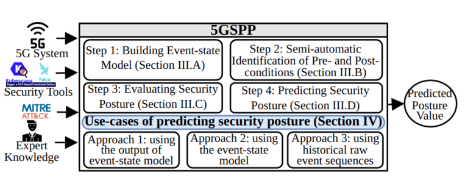

# 5G Security Posture Evaluation and Prediction Framework (5GSPP)

## 📄 Paper Information

**Title**: A Security Posture Evaluation Framework for 5G Networks

**Authors**: Md Nazmul Hoq, Suryadipta Majumdar, Luis Suarez, Lingyu Wang, Amine Boukhtouta, Makan Pourzandi, Mourad Debbabi

---

## 📋 Overview

5GSPP is a comprehensive framework for evaluating and predicting security posture in 5G networks. The project implements multiple approaches to:



1. **Evaluate** security posture based on security monitoring and auditing tools results.
2. **Predict** future security states using various machine learning and probabilistic models
3. **Identify** pre- and post-conditions for a security policy breach 

---

## 🏗️ Project Structure

### 1. **Posture Evaluation** (`1. Posture Evaluation/`)
Builds and analyzes Bayesian Networks from security event sequences to evaluate network security posture.

#### Key Components:
- **Model Builder**: Constructs Bayesian Network models from attack sequences
- **Sequence Generation**: Generates synthetic attack sequences with varying patterns
- **Attack Simulation**: Simulated attack data
- **Data Sequences**: Contains sample sequence data for evaluation

#### Key Files:
- `modeBuilderReadMe.md` - Detailed documentation for the model builder module
- `sequences_atck_pattern.txt` - Attack sequence patterns
- `sequence_test.txt` - Test sequences

---

### 2. **Posture Prediction** (`2. Posture Prediction/`)
Implements three complementary approaches for predicting future security posture states.

#### Approach 1: Posture Value LSTM
**File**: `Approach 1-PostureValueLSTM/`

- **Type**: Time-series based prediction using Bidirectional LSTM
- **Input**: Historical security posture values
- **Output**: Predicted future posture values
- **Patterns Tested**: No pattern, fixed-length, variable-length trend patterns
- **Rate of Change**: Tests ROC values 0.1 - 0.9

Key features:
- LSTM architecture with dropout regularization
- Supports multiple pattern types for robustness evaluation
- Comprehensive rate-of-change experiments

#### Approach 2: Event-State Model-based DBN
**File**: `Approach 2-ESMDBN/`

- **Type**: Dynamic Bayesian Network for temporal reasoning
- **Input**: Event sequences and state models
- **Output**: Multi-step future event predictions
- **Architecture**: Temporal Bayesian inference across multiple time slices

Key features:
- Event-state model generation from historical data
- 15+ generated models with varying structures
- Multi-step inference capability

#### Approach 3: Events LSTM
**File**: `Approach 3-EventsLSTM/`

- **Type**: Deep learning for event sequence prediction
- **Input**: Historical event sequences
- **Output**: Predicted next events in security timeline
- **Architecture**: LSTM network optimized for discrete event sequences

Key features:
- Event embeddings and sequence modeling
- Multiple time-window configurations
- Scalability testing across different dataset sizes
- use model builder to infer posture value using the predicted events
---

### 3. **Log Analysis** (`2. Posture Prediction/Log parser/`)
Correlates and analyzes security tool results 

**Key Features**:
- Log parsing and event extraction
- Temporal correlation of security events
- Rule-based event correlation

---

### 4. **Pre/Post-Condition Identifier** (`2. Posture Prediction/pre-post-condition identifier/`)
Identifies prerequisite conditions and post-attack conditions for security events.

**Key Features**:
- Pre-condition identification for attack execution
- Post-condition analysis for attack impact
- Condition schema definition and validation

---

## 🔧 Environment Setup

### Requirements
- Python 3.8+
- Virtual environment (venv_5gspp)

### Installation

1. **Create and activate virtual environment:**
```bash
cd /home/ubuntu/5GSPP
source venv_5gspp/bin/activate
```

2. **Install dependencies:**
```bash
pip install --upgrade pip
pip install numpy pandas networkx matplotlib scikit-learn scipy pydotplus graphviz pydot "pgmpy<0.1.25" tensorflow tensorflow-keras
```

3. **System dependencies (for graph rendering):**
```bash
sudo apt-get install graphviz
```

---

## 🚀 Quick Start

### Running Model Builder (Posture Evaluation)
```bash
cd "/home/ubuntu/5GSPP/1. Posture Evaluation/Sequence Generation"
PYTHONPATH="/home/ubuntu/5GSPP/1. Posture Evaluation/Model Builder:/home/ubuntu/5GSPP/1. Posture Evaluation/Sequence Generation" \
source /home/ubuntu/5GSPP/venv_5gspp/bin/activate && \
python "/home/ubuntu/5GSPP/1. Posture Evaluation/Model Builder/model_builder.py"
```

### Running Approach 1: Posture Value LSTM
```bash
cd "/home/ubuntu/5GSPP/2. Posture Prediction/Approach 1-PostureValueLSTM"
source /home/ubuntu/5GSPP/venv_5gspp/bin/activate
python posture_rate_of_change_experiment.py
```

### Running Approach 2: Event-State DBN
```bash
cd "/home/ubuntu/5GSPP/2. Posture Prediction/Approach 2-ESMDBN"
source /home/ubuntu/5GSPP/venv_5gspp/bin/activate
python dbn_approach2.py
```

### Running Approach 3: Events LSTM
```bash
cd "/home/ubuntu/5GSPP/2. Posture Prediction/Approach 3-EventsLSTM"
source /home/ubuntu/5GSPP/venv_5gspp/bin/activate
python events_lstm_experiment.py
```

---

## 📊 Experimental Results

Results are documented in the paper and stored in CSV files within respective experiment folders. See the paper for detailed analysis and interpretation.

---

## 📁 Key Input/Output Files

### Input Files Required:
- `sequences.txt` - Event sequences (one per line, comma-separated)
- `structure.json` - Event transition dictionary
- `structure_with_loop.json` - Extended event model with loops
- `structure_with_pattern.json` - Pattern-based event model

### Output Files Generated:
- `synthetic_events.csv` - Generated synthetic event data
- `model.json` - Learned probabilistic model
- `model_struct.dot` / `model_probs.dot` - Graph visualizations
- `experimental_results_*.csv` - Experiment results
- `data_for_exp_*.csv` - Processed experimental data

---

## 📝 Important Notes

### Compatibility
- **pgmpy**: Use version < 0.1.25 for Bayesian Network estimation
- **TensorFlow**: Required for LSTM-based approaches
- **Python Version**: Tested on Python 3.8+

### File Dependencies
- Model Builder imports `generate_seq` from Sequence Generation
- Pre/Post-condition identifier depends on event schema definitions
- Log parser requires structured log formats

### Virtual Environment
Always activate the project's virtual environment before running scripts:
```bash
source /home/ubuntu/5GSPP/venv_5gspp/bin/activate
```
